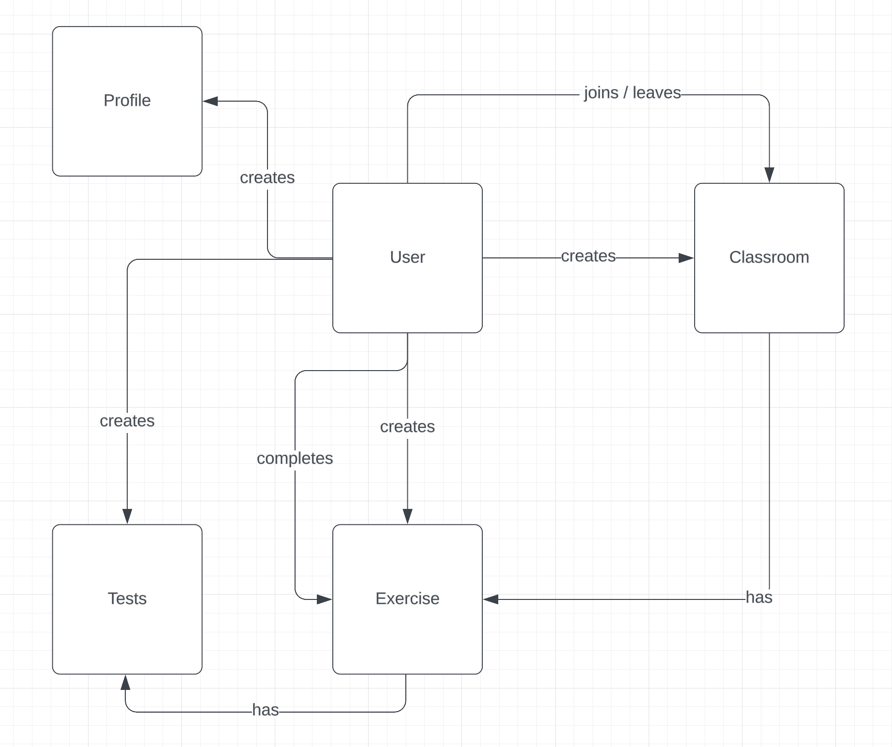
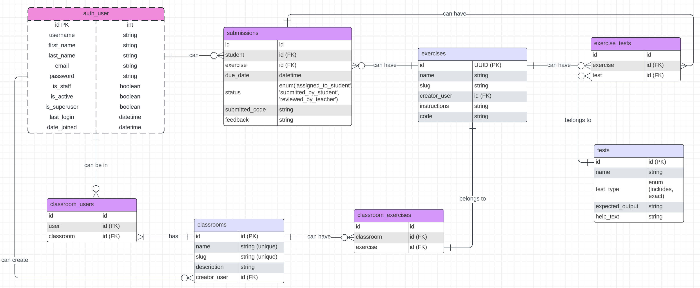
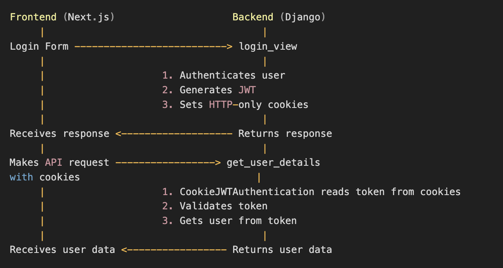
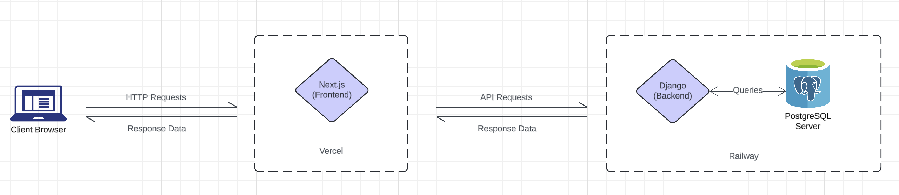

# Luna

Empowering teachers with an interactive web tool for in-browser Python exercises.

Create, manage, and run Python exercises without leaving your browser.

Share it with your students.

[Live Demo](https://luna-frontend-blush.vercel.app/)

## Target Audience

- Computer Science Educators
- Programming Instructors
- Teaching Assistants

<br>

## Use Cases

- Create custom Python exercises with test cases
- Track student progress and submissions
- Provide detailed feedback

<br>

## Python `input()` cases currently supported

<br>

<details>
<summary>1. Basic Input</summary>

<br>

```python
name = input("Enter name: ")
```

</details>

<br>

<details>
<summary>2. Input with Method Chaining</summary>

<br>

```python
# Single method
text = input("Enter text: ").strip()
name = input("Enter name: ").upper()

# Multiple methods
name = input("Enter name: ").strip().title()
command = input("Enter command: ").lower().strip()
```

</details>

<br>

<details>
<summary>3. Input with Type Conversion</summary>

<br>

```python
age = int(input("Enter age: "))
price = float(input("Enter price: "))

# Conversion with strip
number = int(input("Enter number: ").strip())
amount = float(input("Enter amount: ").strip())
```

</details>

<br>

<details>
<summary>4. Input in Control Structures</summary>

<br>

```python
while True:
    choice = input("Continue? (y/n): ").lower().strip()
    if choice == 'n':
        break
```

</details>

<br>

<details>
<summary>5. Input with Nested Function Calls</summary>

<br>

```python
# List comprehension with input
numbers = [int(input(f"Number {i}: ").strip()) for i in range(3)]

# Conditional with input
result = "Valid" if input("Check: ").strip().isdigit() else "Invalid"
```

</details>

<br>

## Tech Stack

### Frontend

- Next.js
- TypeScript

### Backend

- Django REST Framework
- PostgreSQL

<br>

## Architecture

<details>
<summary>Conceptual Model</summary>



</details>

<br>

<details>
<summary>Database Schema</summary>



</details>

<br>

<details>
<summary>Authentication Flow</summary>



</details>

<br>

<details>
<summary>Deployment Architecture</summary>

<br>

Luna uses a modern cloud deployment setup:

- Frontend: Hosted on Vercel for optimal Next.js performance
- Backend: Django REST API deployed on Railway
- Database: PostgreSQL instance managed by Railway

<br>



</details>

<br>

## API Documentation

[View API Documentation](https://luna-backend.up.railway.app/api/schema/swagger-ui/#/)

<br>

## Contributing

Contributions are welcome! Please feel free to submit a PR.
